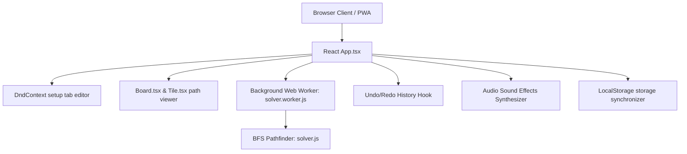

# Labyrinth Game Solver — Architecture & Structure Context

This document outlines the directory layout, background worker pipelines, audio systems, and local history states for AI agents to easily orient themselves.

---

## 🏗️ Technical Architecture

### 1. Web Worker Pipeline
- **Thread Isolation**: The main React UI thread does not perform the BFS path search directly. Complex path searches are handed off to `solver.worker.js` via the `postMessage` protocol.
- **Payload Structure**: The worker receives the formatted board grid, target cards, active pawn color, and the depth (`maxTurns`) to search. It posts back the computed suggestions as an array of solutions.
- **Path Highlights**: When the user hovers over solutions in the sidebar, the board renders golden dots to represent the path coordinates returned by the solver.

### 2. Synthesized Sound System (`utils/audio.ts`)
The application features local retro game audio cues. Instead of loading static audio files, the audio system utilizes the browser's native **Web Audio API**:
- **Sound Types**: Built-in sound generators for `playClickSound`, `playSlideSound`, `playRotateSound`, `playSuccessSound` (major arpeggios when landing on targets), and `playPawnMoveSound`.
- **Mute Status**: Synchronized globally across renders and saved to `localStorage` under `labyrinth_audio_muted`.

### 3. State Management
The Labyrinth project manages its interface states directly inside `App.tsx` and delegates history/caching to two modular React hooks:
- **`useLabyrinthHistory.ts`**: Maintains a deep-cloned state snapshot stack (`HistoryRecord[]`). Tracks undo/redo commands across board configuration and game moves.
- **`useLabyrinthStorage.ts`**: Handles local saves, auto-saves, and profile deletions directly via standard browser `LocalStorage` (sandboxed and serverless).

---

## 📁 Key File Mappings

- **[src/App.tsx](src/App.tsx)**: Main game controller. Handles layout, draggable hooks, start/end setup flags, and the web worker trigger.
- **[src/components/Board.tsx](src/components/Board.tsx)**: Renders the 9x9 layout. Connects edge shift arrows and overlays reachable nodes.
- **[src/components/Tile.tsx](src/components/Tile.tsx)**: Generates CSS-based corridors (straight, corner, t-junction) based on rotation degrees, and overlays pawn tokens.
- **[src/solver.js](src/solver.js)**: Legacy pathfinder algorithm (implements graph BFS and slide shifts).
- **[src/constants.ts](src/constants.ts)**: Configures diagnostic starts (colors, diagonal alignment presets, named treasures).
- **[src/hooks/useLabyrinthStorage.ts](src/hooks/useLabyrinthStorage.ts)**: Interacts with the browser's `LocalStorage` database to save and load named slots and the auto-save.
