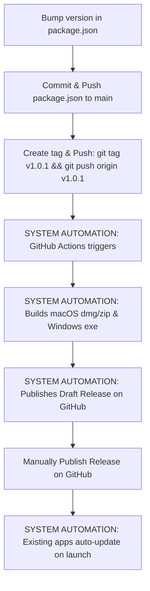

# Labyrinth Game Solver — Development & Releases Guide

This guide explains how to test the application locally on your computer, how to save your changes to GitHub without releasing them, and how to deploy a new public release for macOS and Windows.

---

## 🛠️ Part 1: How to Test Your Changes Locally

Before sharing your code changes with others, you should test them on your machine to ensure everything works correctly.

### 1. Developer Mode (With Instant Updates)
This runs the application inside the native desktop app shell. Any edits you save in the code will immediately update in the open window (Hot Reloading).

**What you do:**
1. Open your terminal in the project directory.
2. Run this command:
   ```bash
   npm run dev
   ```
3. A desktop window will open. Test your features here.
4. Press `Ctrl + C` in the terminal when you want to stop it.

---

### 2. Test the Packaged Production App (Local Compile)
Use this to build the final executable app on your computer exactly as a user would run it. This verifies that packaging works before publishing.

**What you do:**
1. Run this command in the terminal:
   ```bash
   npm run build:electron
   ```
2. **Where to find the built app:**
   - **On macOS:** Open the `release/mac/` folder. You will find a `Labyrinth-Game-Solver.app` that you can double-click to run.
   - **On Windows:** Open the `release/win-unpacked/` folder. You will find a `Labyrinth-Game-Solver.exe` that you can run.

---

## 💾 Part 2: How to Save Code to GitHub (WITHOUT Releasing)

When you are working on a new feature or bug fix and want to save it on GitHub, but are **not** ready to make it a public update for users.

### Developer Steps (What you do):
1. **Create a new branch** (keeps changes separate from the stable code):
   ```bash
   git checkout -b feature/my-new-improvement
   ```
2. **Stage your modified files:**
   ```bash
   git add .
   ```
3. **Commit your changes with a descriptive message:**
   ```bash
   git commit -m "Description of changes" -m "More details about what was updated..."
   ```
4. **Push the branch to GitHub:**
   ```bash
   git push -u origin feature/my-new-improvement
   ```

---

## 🚀 Part 3: How to Build & Publish a Public Release

Follow these steps when you want to deploy a new version of the app to your users on macOS and Windows.



### Developer Steps (What you do):

1. **Switch to the main branch** and pull the latest stable code:
   ```bash
   git checkout main
   git pull origin main
   ```
2. **Bump the version number:**
   Open the file [package.json](package.json) and change the `"version"` field (e.g. from `"1.0.0"` to `"1.0.1"`):
   ```json
     "name": "labyrinth",
     "version": "1.0.1",
   ```
3. **Commit and push the version bump:**
   ```bash
   git add package.json
   git commit -m "Bump version to v1.0.1" -m "Preparing version 1.0.1 release."
   git push origin main
   ```
4. **Create a version tag and push it to GitHub:**
   Run these two commands in order (replace `v1.0.1` with the version you set in step 2):
   ```bash
   git tag v1.0.1
   git push origin v1.0.1
   ```
5. **Publish the Release:**
   Go to your GitHub repository on the web, click **Releases**, select the new draft release that was just compiled, write a short description of the changes, and click **Publish Release**.
