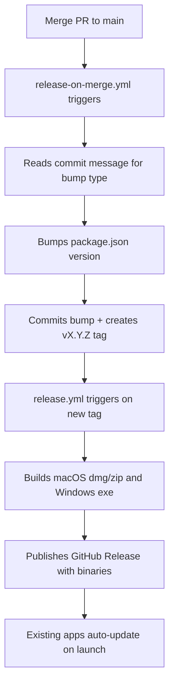

# Labyrinth Game Solver — Development & Releases Guide

This guide explains how to test the application locally, how to save changes to GitHub without releasing them, and how the automated release pipeline works.

---

## 🛠️ Part 1: How to Test Your Changes Locally

### 1. Developer Mode (Hot Reloading)
Runs the app inside the Electron shell. Code edits update the window instantly.

```bash
npm run dev
```

### 2. Run Tests & Type-Check
```bash
npm run test        # Vitest unit tests (run once)
npm run test:watch  # Watch mode
npm run typecheck   # TypeScript type-check only
npm run lint        # oxlint
```

### 3. Test the Packaged Production App
Build and run the final executable locally before publishing.

```bash
npm run build:electron
```

- **macOS:** `release/mac/Labyrinth-Game-Solver.app`
- **Windows:** `release/win-unpacked/Labyrinth-Game-Solver.exe`

---

## 💾 Part 2: How to Save Code to GitHub (WITHOUT Releasing)

Work on a feature branch and open a PR. Merging to `main` automatically triggers a release (see Part 3), so **never merge to main unless you intend to ship**.

```bash
# Create a branch
git checkout -b feat/my-improvement

# Commit with a conventional commit prefix (controls version bump — see below)
git add .
git commit -m "feat: add solver depth selector"

# Push and open a PR
git push -u origin feat/my-improvement
```

---

## 🚀 Part 3: Automated Release Pipeline

**Merging to `main` automatically creates a release.** You do not manually tag or bump the version — the pipeline handles it.



### Version Bump Rules (Conventional Commits)

The version bump is determined by your **merge commit message** (or the squash message if you squash-merge):

| Commit prefix | Bump type | Example |
|---|---|---|
| `BREAKING CHANGE` anywhere in the message | **major** | `1.2.3 → 2.0.0` |
| `feat:` or `feat(scope):` | **minor** | `1.2.3 → 1.3.0` |
| Everything else (`fix:`, `chore:`, `refactor:`, `docs:`, `style:`, `perf:`, `test:`, `ci:`) | **patch** | `1.2.3 → 1.2.4` |

### Commit Prefix Guide

Use these prefixes on **every commit** so the release pipeline knows what kind of change it is:

| Prefix | When to use |
|---|---|
| `feat:` | A new user-facing feature |
| `fix:` | A bug fix |
| `refactor:` | Internal code restructure, no behaviour change |
| `chore:` | Tooling, deps, config — nothing the user sees |
| `docs:` | Documentation only |
| `style:` | Formatting, whitespace |
| `perf:` | Performance improvement |
| `test:` | Adding or fixing tests |
| `ci:` | CI/CD pipeline changes |
| `BREAKING CHANGE:` | Anything that breaks existing saved data or behaviour |

### Examples

```bash
# Patch bump (1.0.1 → 1.0.2) — bug fix
git commit -m "fix: correct pawn start positions at red and green corners"

# Minor bump (1.0.1 → 1.1.0) — new feature
git commit -m "feat: add multi-turn solver preview overlay"

# Major bump (1.0.1 → 2.0.0) — breaks saves or API
git commit -m "refactor: redesign save slot schema

BREAKING CHANGE: existing save slots are not compatible with this version"
```

### What Happens After a Merge

1. `release-on-merge.yml` reads the commit message, bumps `package.json`, commits `chore: bump version to vX.Y.Z [skip ci]`, and pushes a `vX.Y.Z` tag.
2. The tag push fires `release.yml`, which builds on both macOS and Windows runners and uploads the binaries to a new GitHub Release.
3. The release is published automatically — no manual step required.

### If You Need to Skip a Release

Add `[skip ci]` to your commit message to prevent the pipeline from running:

```bash
git commit -m "docs: update readme [skip ci]"
```

---

## 🔧 Part 4: Manual Release (Fallback)

If you ever need to cut a release manually without merging (e.g. hotfix directly on main):

```bash
git checkout main && git pull origin main

# Manually set the version in package.json, then:
git add package.json
git commit -m "chore: bump version to v1.2.0"
git tag v1.2.0
git push origin main --follow-tags
```

This skips `release-on-merge.yml` and triggers `release.yml` directly via the tag push.
