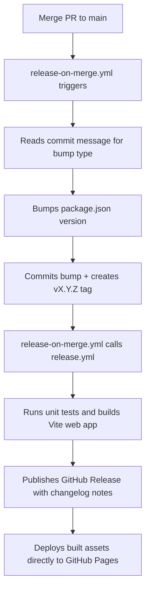

# Labyrinth Game Solver — Development & Releases Guide

This guide explains how to test the application locally, how to commit changes to GitHub, and how the automated release and deployment pipeline works.

---

## 🛠️ Part 1: How to Test Your Changes Locally

### 1. Developer Mode (Hot Reloading)
Runs the app inside your local web browser. Code edits update the browser window instantly.

```bash
npm run dev
```
Open **`http://localhost:3000`** in your browser.

### 2. Run Tests & Type-Check
Ensure your edits do not break compiler types or solver expectations:
```bash
npm run test        # Vitest unit tests (run once)
npm run test:watch  # Watch mode for active development
npm run typecheck   # TypeScript compile check
npm run lint        # Lint check via oxlint
```

### 3. Test the Production Bundle Locally
Build and preview the final minified web assets locally before pushing:

```bash
npm run build       # Compiles static files into dist/
npm run preview     # Serves the compiled dist/ folder locally
```
Open **`http://localhost:4173`** (or the port output in terminal) to test the exact production output.

---

## 💾 Part 2: How to Save Code to GitHub (WITHOUT Releasing)

Work on a feature branch and open a PR. Merging to `main` automatically triggers a release (see Part 3), so **never merge to main unless you intend to ship**.

```bash
# Create a branch
git checkout -b feat/my-improvement

# Commit with a conventional commit prefix (controls version bump)
git add .
git commit -m "feat: add solver depth selector"

# Push and open a PR
git push -u origin feat/my-improvement
```

---

## 🚀 Part 3: Automated Release & Deploy Pipeline

**Merging to `main` automatically creates a release and deploys it.** You do not manually tag or bump the version — the pipeline handles it.



### Version Bump Rules (Conventional Commits)

The version bump is determined by your **merge commit message** (or the squash message if you squash-merge):

| Commit prefix | Bump type | Example |
|---|---|---|
| `BREAKING CHANGE` anywhere in the message | **major** | `1.2.3 → 2.0.0` |
| `feat:` or `feat(scope):` | **minor** | `1.2.3 → 1.3.0` |
| Everything else (`fix:`, `chore:`, `refactor:`, `docs:`, `style:`, `perf:`, `test:`, `ci:`) | **patch** | `1.2.3 → 1.2.4` |

### Commit Prefix Guide

Use these prefixes on **every commit** so the release pipeline knows what kind of change it is:

| Prefix | When to use |
|---|---|
| `feat:` | A new user-facing feature (like a new UI element) |
| `fix:` | A bug fix |
| `refactor:` | Internal code restructure, no behaviour change |
| `chore:` | Tooling, dependencies, configuration changes |
| `docs:` | Documentation edits |
| `style:` | Code formatting, trailing commas, whitespace |
| `perf:` | Performance improvements |
| `test:` | Adding or fixing unit tests |
| `ci:` | CI/CD pipeline changes |
| `BREAKING CHANGE:` | Anything that breaks existing saved data or behaviour |

### Examples

```bash
# Patch bump (1.0.1 → 1.0.2) — bug fix
git commit -m "fix: correct pawn start positions at red and green corners"

# Minor bump (1.0.1 → 1.1.0) — new feature
git commit -m "feat: add multi-turn solver preview overlay"
```

### What Happens After a Merge

1. `release-on-merge.yml` reads the commit message, bumps `package.json`, commits `chore: bump version to vX.Y.Z`, and pushes a `vX.Y.Z` tag.
2. `release-on-merge.yml` then explicitly calls the reusable `release.yml` workflow, passing the new tag to it.
3. `release.yml` runs on a fast, free Ubuntu runner. It runs unit tests, compiles the production code, generates release notes, and uploads the artifacts.
4. The GitHub Release is published, and the new build is instantly deployed to your **GitHub Pages** URL!

### If You Need to Skip a Release

Add `[skip ci]` to your commit message to prevent the pipeline from running:

```bash
git commit -m "docs: update readme [skip ci]"
```
