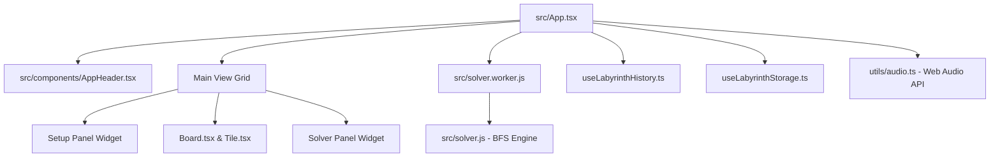

# Architecture: Labyrinth Solver V2

This document details the system design, directory structures, worker pipelines, and state management flow of the Labyrinth Solver.

## Core Component Diagram


## Folder Structure (Modernized V2)

To reduce technical debt and maximize maintainability, files are grouped logically by concern:

```
src/
├── assets/             # Raw svg / graphic resources
├── components/         # React markup and presentation
│   ├── ui/             # Radix & Shadcn UI primitive blocks
│   ├── board/          # Board rendering & Tile renderers
│   ├── panels/         # Left and Right panels (Setup / Solver widgets)
│   └── modals/         # Dialog views (MoveHistory, Settings, PhotoScan)
├── hooks/              # State & behavior lifecycle code
├── lib/                # Adapters, utilities, and helper code
├── utils/              # Base services (e.g. Synthesized Audio system)
├── types.ts            # Common type interfaces
├── solver.js           # Core BFS search calculations
├── solver.worker.js    # Off-thread Web Worker wrapper
└── main.tsx            # App render mounting
```

## System Modules

### 1. Web Worker Pipeline
Complex pathfinder searches run inside `solver.worker.js` (Web Worker).
- **Communication Protocol**: JSON messages containing the serialized 7x7 board state, players' current target coordinates, active pawn color, and search depth parameters (`maxTurns`).
- **Response**: The solver returns a sorted list of best moves, each featuring path coordinates (`pawnPath`), arrow directions, and explanations.

### 2. State & History Synchronization
- **`useLabyrinthHistory`**: Keeps deep cloned snapshots of `AppGameState` to manage custom undo/redo actions.
- **`useLabyrinthStorage`**: Autosaves board and game state to `localStorage` (`labyrinth_strategist_state`) and restores it on reload.

### 3. Native Web Audio Synth
Audio feedback is synthesized dynamically using the Web Audio API in `src/utils/audio.ts` (minimizing app footprint by not packing static mp3/wav files).
